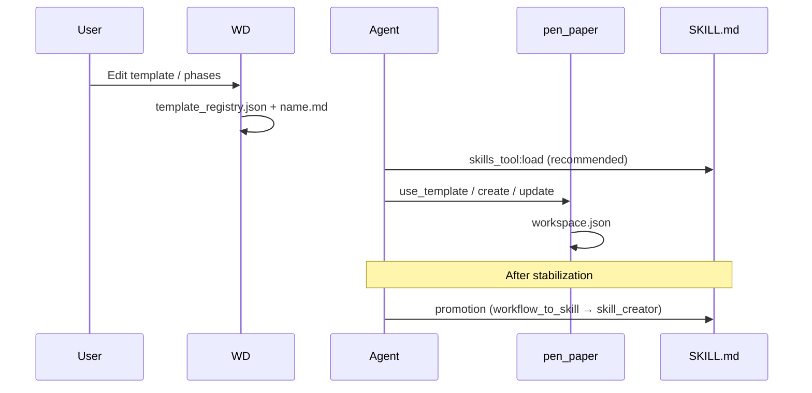
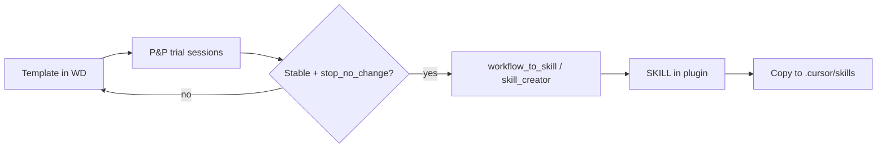

# Architecture Contract: Workflow Dashboard ↔ Pen & Paper ↔ SKILL.md

**Version:** 0.1 (phase 1 specification)  
**Date:** 2026-05-27  
**Status:** Based on code + baseline; Agent Zero answers — see [`AGENT_ZERO_RESPONSES.md`](AGENT_ZERO_RESPONSES.md) (to be filled)

---

## 1. Entities and responsibilities

| Entity | Responsible for | Not responsible for |
|--------|-----------------|---------------------|
| **WD** (Workflow Dashboard) | Template editing, `template_registry.json`, phases/triggers, feature policy (UI), Canvas↔disk sync | Running sessions, agent reasoning, step orchestration (yet) |
| **P&P** (Pen & Paper) | `workspace.json`, sections, `create`/`update`/`close`, `use_template` | Long-term policy, promotion to SKILL |
| **SKILL.md** | Stable cross-model behavior, triggers, explicit tool sequence, mandatory output shape | Raw template storage, visual editing |



---

## 2. Data interface — template (WD → P&P)

### 2.1 Registry entry (target Wave 0+)

```json
{
  "templates": {
    "incident_response": {
      "file": "incident_response.md",
      "version": "1.0.0",
      "description": "Structured incident triage",
      "description_he": "Optional localized description",
      "phases": ["Triage", "Mitigate", "Postmortem"],
      "triggers": ["incident", "outage", "SEV"]
    }
  },
  "base_workflows": {
    "list": ["research", "debugging", "validation"],
    "hooks": {
      "on_unknown": "research",
      "on_stuck": "debugging",
      "on_error": "debugging",
      "on_complete": "validation"
    }
  }
}
```

**Rule:** Every value in `hooks` **must** exist in `templates` with a matching `.md` file.

### 2.2 Session workspace (P&P — current)

```json
{
  "metadata": {
    "name": "string",
    "created_at": "ISO8601",
    "status": "active|closed",
    "template": "template_name|null",
    "template_version": "semver (Wave 0 target)"
  },
  "findings": [],
  "results": [],
  "insights": [],
  "notes": [],
  "decisions": [],
  "backtrack": [],
  "execution_log": []
}
```

`execution_log` — **Wave 2 target** (not in `VALID_SECTIONS` today).

### 2.3 execution_log entry (Wave 2 target)

```json
{
  "step_id": "phase_1_triage",
  "status": "pending|running|done|failed|skipped",
  "started_at": "ISO8601",
  "completed_at": "ISO8601|null",
  "tool_calls": ["pen_paper:update:findings"],
  "outputs_ref": "results[-1]"
}
```

**Status alignment:** Use `done` (not `COMPLETED`) per `WorkflowStepStatus` in `a0_lmm_router`, or update `rules.yaml` in Wave 2.

### 2.4 Step payload (orchestrator target — Wave 3)

```json
{
  "workflow_id": "incident_response",
  "template_version": "1.0.0",
  "step_id": "phase_1_triage",
  "inputs": { "SEV": "1" },
  "required_sections": ["findings", "decisions"],
  "output_schema": {
    "type": "object",
    "required": ["decision", "next_step"],
    "properties": {
      "decision": { "type": "string" },
      "next_step": { "type": "string" }
    }
  }
}
```

---

## 3. Mandatory tool sequence (SKILL — stable behavior)

For every promoted workflow:

1. `skills_tool:load` → dedicated skill (or `pen-paper-workflows` for editing)
2. `pen_paper` → `list_templates` (if name unknown)
3. `pen_paper` → `use_template` with explicit `variables`
4. Per phase: `pen_paper` → `update` to the defined section **before** marking the phase complete in notes
5. `pen_paper` → `close` with `vectorize`/`ephemeral` per SKILL policy (not tool defaults)

**SKILL prohibitions:**

- Do not check off items in notes without a matching `update`
- Do not skip `close` on an active session
- `stop_no_change` on production templates in WD

---

## 4. Pre/post checks

| Check | Validates | Implemented today | Target |
|-------|-----------|-------------------|--------|
| Pre: valid template name | regex `^[a-z0-9_]+$` | `workflows_store` | Done |
| Pre: session open for update | `status != closed` | `pen_paper.py` | Done |
| Pre: previous step done | step_id | — | Wave 3 |
| Post: required sections | schema | — | Wave 2+3 |
| Post: registry↔MD sync | file exists | Partial | Wave 0 |
| UI: dirty before switch | Alpine store | Canvas | Done |
| UI: Live session append | etag match on `workspace.json` | Wave 4 | Done |

---

## 4.1 WD Live mode ↔ P&P sessions (Wave 4)

| Mode | Data path | Write |
|------|-----------|-------|
| **Templates** | `knowledge/workflows/<name>.md` | `workflows_save` |
| **Live** | `sessions/active/<name>/workspace.json` | `sessions_append` only (append entry) |

- **Focus:** `usr/pen_and_paper/.ui/focus.json` updated after `pen_paper` tool calls; UI **Follow agent** reads `sessions_focus` scoped by `chat_id`.
- **Chat scope:** `workspace.metadata.chat_id` set on create/update; Live list sends `chat_id` from open chat (`$store.chats.selectedContext.id`); badge **צ'אט זה** when `is_current_chat`.
- **Conflict:** `sessions_append` requires `etag` from last `sessions_get`; mismatch returns `error: stale`.
- **UI entries:** `{ "source": "ui", "author": "user", "content": "...", "timestamp": "ISO8601" }`.

See [`LIVE_SESSION_VIEW_SPEC.md`](LIVE_SESSION_VIEW_SPEC.md).

---

## 5. Promotion: P&P → SKILL



- **Agent Zero:** `a0_skill_creator` (eval + triggers)
- **Cursor:** Manual copy — see [`CURSOR_CLAUDE_PORTING.md`](CURSOR_CLAUDE_PORTING.md)
- Do **not** use `bmad-promote` for P&P unless the workflow is BMAD-owned

---

## 6. Current vs target (summary)

| Capability | Today | Target |
|------------|-------|--------|
| WD template editing | Yes | + version, schema |
| P&P session | Yes | + execution_log |
| Automatic hooks | No (broken metadata) | Wave 0+3 |
| config → tool | No | Wave 1 |
| JSON Schema for templates | No | Wave 2 |
| Orchestrator | Yes (MVP) | Wave 3 |
| Live session mirror in Canvas | Yes | Wave 4 |
| Cross-model SKILL | Partial | promotion + porting |

---

## 7. Resolved findings (Agent Zero, 2026-05-27)

| # | Finding | Decision / implementation |
|---|---------|---------------------------|
| 1 | Skill vs P&P | Skill = behavior; P&P = runtime state. `skills_tool:load` before session (documented in skills). |
| 5 | Hooks without MD | **Fixed Wave 0** — `research`, `debugging`, `validation` templates added. |
| 12 | config.html vs tool | UI does not drive tool; **Wave 1** — `pen_paper` uses `load_plugin_config` / `feature_enabled`. |
| 10–11 | execution_contract ignored | **Wave 2–3** — `execution_log` section + `workflow_executor` idempotency; status `done` not `COMPLETED`. |
| 3 | Canvas race | Documented in SKILL; etag deferred (Wave 1 optional). |
| 6 | Cross-model diff | No matrix yet; use `pen-and-paper-workflow` SKILL + UAT template in PORTING. |
| 13–14 | Promotion | P&P keeps prototypes; SKILL gets stable behavior; `a0_skill_creator` after 2 successful runs. |
| 16 | plugin_debugger audit | Config/hooks/contract broken → addressed in Waves 0–3. |

Artifacts: `usr/workdir/pen_paper_phase1_artifacts/` (Agent Zero run).

---

## 8. References

- Baseline: [`ENV_BASELINE.md`](ENV_BASELINE.md)
- Waves: `WAVE0_SPEC.md` … `WAVE3_SPEC.md`
- Porting: [`CURSOR_CLAUDE_PORTING.md`](CURSOR_CLAUDE_PORTING.md)
