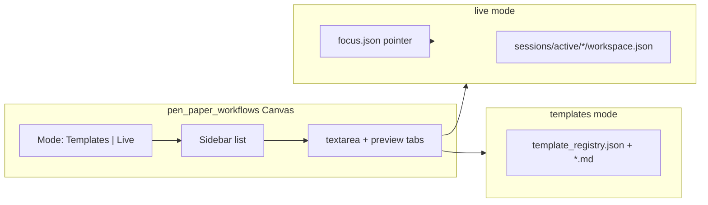

# Live Session View — Phase 1 Specification

**Version:** 0.2  
**Date:** 2026-05-28  
**Status:** Implemented (4a + 4b + 4c)  
**Relates to:** [CONTRACT.md](CONTRACT.md), Wave 4

---

## 1. Problem

Users want to **see what the agent is working on right now** in Pen & Paper — copy text, skim the latest section, or add a short correction — without parsing tool output in the chat transcript.

Today:

| Surface | Data | Live agent work? |
|---------|------|------------------|
| **Workflow Dashboard** (`pen_paper_workflows` Canvas) | `usr/pen_and_paper/knowledge/workflows/*.md` + registry | No — policy/templates only |
| **`pen_paper` tool** | `usr/pen_and_paper/sessions/active/<name>/workspace.json` | Yes — but UI-only via chat |
| **Whiteboard** (`a0_whiteboard`) | Drawing state + WebSocket | Yes — different medium (not markdown sections) |

The Workflows panel already has the right **UX shell** (sidebar list, edit/preview tabs, polling, dirty/save). It does **not** yet connect to **runtime sessions**.

---

## 2. Goal

Add a **Live Session** mode inside the existing Workflows Canvas surface so the user can:

1. **Follow** the workspace/section the agent last touched (default).
2. **View** rendered markdown (copy-friendly preview).
3. **Edit** safely (append user input; optional direct edit in a later wave).
4. Open the same surface from config (“open in Canvas”) without a second plugin entry.

**Non-goals (phase 1):**

- Replacing the main chat or tool transcript.
- Full collaborative editing with conflict resolution (etag) — defer to Wave 4c.
- Orchestrating workflow steps from the UI (still agent + SKILL).

---

## 3. Recommended component model

### 3.1 One surface, two modes (attach to WD — do not fork UI)

Keep a single Right Canvas surface: `pen_paper_workflows`.

Add a top-level **mode** in `penPaperWorkflows` Alpine store:

| Mode | Sidebar lists | Main editor source | Save action |
|------|---------------|-------------------|-------------|
| `templates` | Registry template names | `workflows_get` → `.md` body | `workflows_save` (existing) |
| `live` | Active P&P session names | `sessions_get` → section slice | `sessions_append` (new) |



**Why this fits Agent Zero:** Same pattern as Workflows today (Canvas editor + disk sync + poll). Whiteboard proves **push** via WebSocket later; MVP can **poll** like templates (2.5s → 1s in live mode).

### 3.2 Optional later: dedicated surface

`pen_paper_live` as a second surface is possible but **not recommended for MVP** — duplicates register/open logic and splits user attention. Prefer mode toggle + header tab in `workflows-panel.html`.

---

## 4. “What page is the agent on?” — focus contract

The UI needs a stable **focus pointer**, not guesswork from chat text.

### 4.1 Focus file (server-side, cheap)

Path (proposed):

`usr/pen_and_paper/.ui/focus.json`

```json
{
  "chat_id": "jpdsS7u1",
  "workspace": "verification_checklist",
  "section": "notes",
  "entry_index": 2,
  "action": "update",
  "updated_at": "2026-05-27T23:15:00+03:00",
  "workspace_mtime": 1716842100.42
}
```

**Writers:**

| Event | Writer |
|-------|--------|
| `pen_paper` tool `create` / `use_template` | `tool_execute_after` extension |
| `pen_paper` `update` / `read` (section) | same |
| User selects session/section in Live UI | API `sessions_set_focus` |

**Readers:**

- `GET /plugins/a0_pen_paper/sessions_focus?chat_id=<current>`
- Live store: if `followAgent === true`, auto-select workspace/section from focus.

**Scope:** Focus is **per chat** when `chat_id` is available from Agent Zero context; fallback to global “most recently updated active workspace” if not.

### 4.2 Mapping “page” to UI

| User mental model | P&P reality | Live UI label |
|-------------------|-------------|---------------|
| “The doc the agent edits” | One **workspace** (`workspace.json`) | Session name in sidebar |
| “Current section” | `findings`, `notes`, `results`, … | Section dropdown |
| “Latest paragraph” | Last array entry in section | Preview shows concatenated or last entry |
| “Template behind session” | `metadata.template` | Badge + link “Open template” → switches to `templates` mode |

For **VERIFICATION_CHECKLIST.md**-style work: agent likely uses workspace name matching task + `notes` / `findings` sections — Live mode shows that slice, not the template file under `knowledge/workflows/`.

---

## 5. API additions (plugin)

Mirror `workflows_*` naming under `/plugins/a0_pen_paper`:

| Endpoint | Purpose |
|----------|---------|
| `sessions_list` | Active workspaces (from `sessions/active/`), summary counts, template name, mtime |
| `sessions_get` | Full workspace or `{ workspace, section }` with `entries[]`, `mtime`, `etag` (hash of file) |
| `sessions_focus` | Read focus for chat (or latest) |
| `sessions_set_focus` | User pin: workspace + section |
| `sessions_append` | Append user text to section (see §6) |

Implementation note: reuse logic from `pen_paper.py` `_list_workspaces`, `_read_workspace`, `_update_workspace` via shared helper `helpers/sessions_store.py` (avoid duplicating JSON paths).

**Auth:** Same as existing plugin APIs (local Agent Zero instance).

---

## 6. Edit semantics (safe by default)

| User action | Phase 1 behavior | Agent visibility |
|-------------|------------------|------------------|
| Copy from preview | Client-only | — |
| “Add note” / Save in Live | `sessions_append` → new entry in `notes` (or `user_inputs` section) with `source: "ui"`, `author: "user"` | Next `pen_paper read` |
| Edit last agent entry in place | **Deferred** (conflict risk) | — |
| Edit template while agent runs session | Templates mode unchanged | Independent |

Proposed append entry shape:

```json
{
  "timestamp": "ISO8601",
  "content": "User pasted correction here",
  "source": "ui",
  "author": "user"
}
```

SKILL addition (when promoted): agent must `read` `notes` after user reports edits in chat, or poll `user_inputs` if that section is added to `VALID_SECTIONS`.

---

## 7. UI changes (minimal diff to existing files)

### 7.1 `workflows-panel.html`

- Header: segmented control **Templates | Live**.
- Live sidebar: sessions from `sessions_list`; badge for `status`, template name.
- Live main: section `<select>`; reuse existing **Edit / Preview** tabs.
- Footer: path hint `sessions/active/<name>/` instead of `knowledge/workflows/`.
- Buttons: **Follow agent** (toggle), **Copy**, **Add to session** (calls `sessions_append`).
- Link: “Edit template” → `mode = templates`, `select(metadata.template)`.

### 7.2 `workflows-store.js`

- State: `mode`, `sessions[]`, `selectedSession`, `selectedSection`, `followAgent`, `sessionContent`, `sessionMtime`, `sessionEtag`.
- Poll: `_pollSessionChanges()` when `mode === 'live'` (1–2s).
- `onOpen(payload)`: support `{ mode: 'live', workspace, section }` from deep links.
- Dirty rules: Live mode dirty only for unsaved user draft (not remote agent updates).

### 7.3 `register-pen-paper.js`

- No new surface ID; pass payload through `open({ mode: 'live', ... })`.

### 7.4 Extension

`extensions/python/tool_execute_after/_51_pen_paper_focus.py`:

- On `pen_paper` success, update `focus.json` with workspace/section from tool args.

---

## 8. Integration flows

### 8.1 User opens Workflows during agent run

1. User opens Canvas → Workflows.
2. Switches to **Live** tab.
3. **Follow agent** on → UI jumps to last `pen_paper` update.
4. Preview tab shows markdown; user copies checklist line.
5. User types fix → **Add to session** → append to `notes`.

### 8.2 User editing VERIFICATION_CHECKLIST template vs agent filling session

| Intent | Mode |
|--------|------|
| Change checklist template for all future runs | **Templates** → `verification` (or dedicated template name) |
| See what agent wrote this run | **Live** → session linked to chat |

Clarify in AGENT_HANDOFF: WD template file ≠ live session content.

### 8.3 From plugin config

Existing config copy mentions real-time Canvas — align implementation with **Live** mode, not template save.

---

## 9. Comparison with Whiteboard

| | Whiteboard | Live Session (proposed) |
|--|------------|-------------------------|
| Data | TLDraw / canvas JSON | `workspace.json` sections |
| Sync | WebSocket | Poll MVP → WS optional |
| Agent tool | whiteboard tools | `pen_paper` |
| User edit | Direct on canvas | Append-first |

Reuse **pattern** (extension updates + client poll/WS), not the whiteboard engine.

---

## 10. Phased delivery

| Wave | Deliverable | Status |
|------|-------------|--------|
| **4a** | `sessions_list`, `sessions_get`, `sessions_focus` + focus extension; Live mode read-only + follow + copy | Done |
| **4b** | `sessions_append`, user draft + save; section selector | Done |
| **4c** | etag conflict banner on stale append | Done |
| **4d** | WebSocket `pen_paper_session_changed` | Deferred |

---

## 11. Verification (add to checklist Tier G)

- Agent `create` + `update:notes` → Live UI updates within poll interval without refresh.
- Follow agent: switching workspace in tool changes Live selection.
- Append from UI → visible in `pen_paper read`.
- Templates mode still saves independently; no cross-write to `workspace.json`.
- Two tabs: agent updates while user has draft → draft preserved; preview refreshes.

---

## 12. Open questions

1. **Per-agent vs per-chat focus** when multiple agents run in one chat?
2. **New section `user_inputs`** vs append to `notes` with `source: ui`?
3. Should Live mode auto-open Canvas on first `pen_paper` in session (config flag)?
4. Expose focus to **Cursor** via file path for external copy workflow?

Record answers in `AGENT_ZERO_RESPONSES.md` when validated in Agent Zero.

---

## 13. File touch list (implementation reference)

| File | Change |
|------|--------|
| `api/sessions_*.py` | New endpoints |
| `helpers/sessions_store.py` | Shared read/list/append/focus |
| `extensions/python/tool_execute_after/_51_pen_paper_focus.py` | Focus writer |
| `webui/workflows-store.js` | Dual mode + session poll |
| `webui/workflows-panel.html` | Mode toggle + live sidebar |
| `skills/pen-and-paper-workflow/SKILL.md` | Mention UI append convention |
| [VERIFICATION_CHECKLIST.md](VERIFICATION_CHECKLIST.md) | Tier G |

**Do not** conflate with `workflows_save` — different path, different conflict rules.
