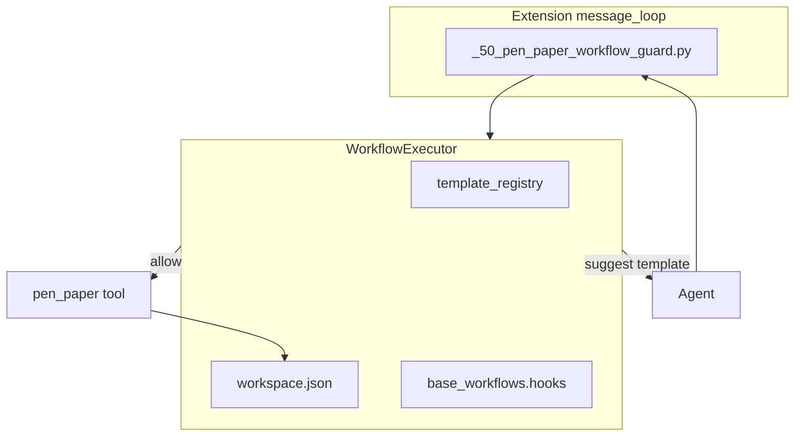

# Wave 3 — Orchestrator (architecture decision)

**Dependencies:** Waves 0–2  
**Goal:** Enforced step policy; optional automatic hooks; state guards.

---

## Core decision

| Option | Description | Use when |
|--------|-------------|----------|
| **A — Executor in `a0_pen_paper`** | Loop/extension before `pen_paper` reads registry + `execution_log` | Want simplicity, less lmm_router coupling |
| **B — Revive SmartRouter** | `_20_smart_router.py` runs `_execute_workflow_steps` | Router logic already exists and model routing matters |
| **C — Hybrid** | P&P owns state; router only picks models | Separation of concerns |

### Specification recommendation: **A (Executor in P&P)**

**Rationale:**

1. `workspace.json` and templates already live in P&P — single source of truth.
2. SmartRouter is **disabled**; `Session` in lmm_router is **not wired** to `pen_paper`.
3. `execution_contract` in `rules.yaml` belongs to the P&P plugin.
4. BMAD shows `skills_tool:load` is enough for most workflows; a light executor beats a full router.

**Use lmm_router only** if per-step model routing is required — then **C**.

---

## Proposed architecture (option A)



### `WorkflowExecutor` (new)

Suggested path: `usr/plugins/a0_pen_paper/helpers/workflow_executor.py`

```python
class WorkflowExecutor:
    def resolve_hook(self, event: str) -> str | None: ...
    def pre_step(self, workspace, step_id) -> PreCheckResult: ...
    def post_step(self, workspace, step_id) -> PostCheckResult: ...
    def suggest_template(self, user_message: str) -> str | None: ...
```

### Extension (pre-tool)

- Before `pen_paper` `update`/`close`: check `execution_log` + previous step
- After tool failure: suggest `on_error` → `debugging` (after Wave 0)

### Limited automatic hooks

| Event | Action |
|-------|--------|
| `on_stuck` | System hint: "recommended: use_template debugging" |
| `on_error` | Same |
| `on_complete` | post_step check before close |

**Do not** auto-run sub-agents in Wave 3 MVP — **hints + validation only**.

---

## Option B — SmartRouter (if chosen)

| Task | File |
|------|------|
| Enable extension | `_20_smart_router.py` |
| Connect P&P registry | import from `workflows_store` |
| Merge `Session.steps` ↔ `execution_log` | adapter layer |
| Regression tests | historical chats |

**Risk:** Two parallel state models — requires an explicit adapter.

---

## State guards (shared)

| Guard | Pre | Post |
|-------|-----|------|
| Active session | update/close | — |
| Template matches metadata | create from use_template | — |
| Previous step done | next log_step | — |
| Sections complete | — | before next phase |
| JSON in results | — | if output_schema defined |

---

## Files (option A)

| File | New/updated |
|------|-------------|
| `helpers/workflow_executor.py` | New |
| `extensions/python/message_loop/_50_pen_paper_workflow_guard.py` | New |
| `data/config/rules.yaml` | enforcement → P&P executor |
| `tools/pen_paper.py` | executor calls on close/update |

---

## Acceptance tests

- [ ] Cannot mark a second step done without changes
- [ ] `on_stuck` suggests an existing template (after Wave 0)
- [ ] close blocked if post_check fails (SKILL may allow emergency override)
- [ ] Basic flow does not depend on SmartRouter

---

## Decision summary

| Item | Decision |
|------|----------|
| Primary orchestrator | **P&P WorkflowExecutor (A)** |
| SmartRouter | Not required for MVP; consider C later |
| Step status | `done` (aligned with `WorkflowStepStatus`) |
| Hooks | Suggest + validate, not full automation in MVP |
